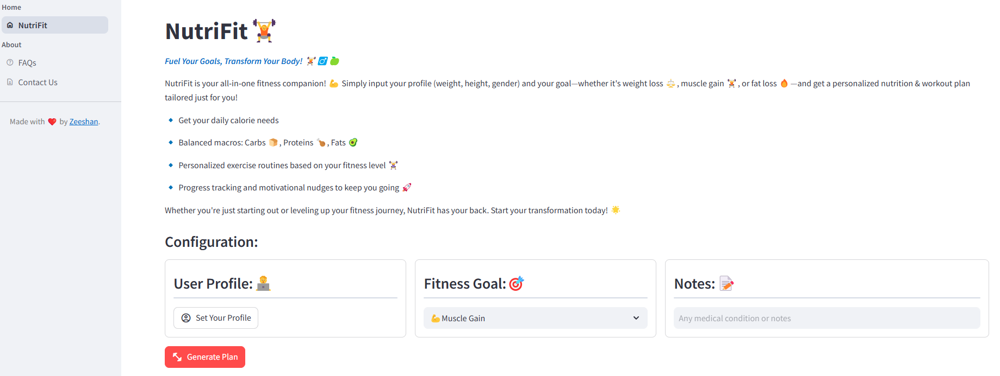
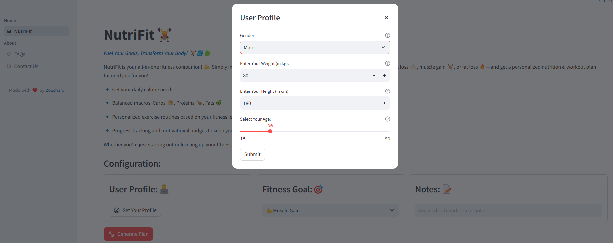
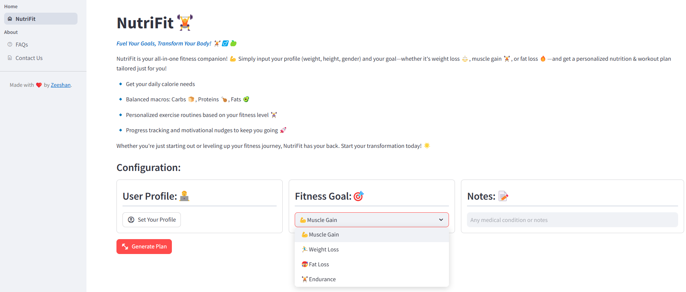
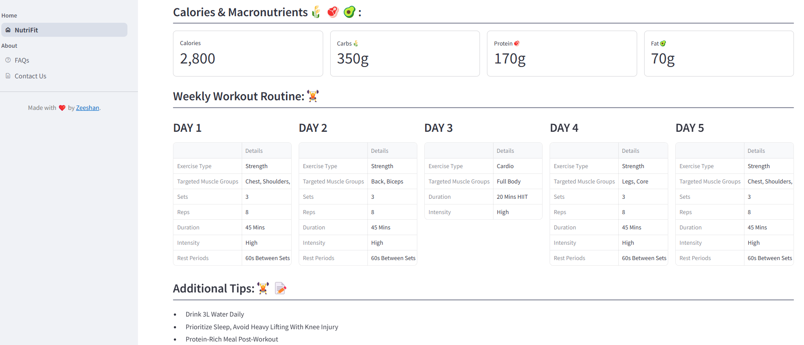

# NutriFit🏋️
Fuel Your Goals, Transform Your Body! 🏋️♂️🍏

NutriFit is your all-in-one fitness companion! 💪 Simply input your profile (weight, height, gender) and your 
goal—whether it's weight loss ⚖️, muscle gain 🏋️, or fat loss 🔥—and get a personalized nutrition & workout plan 
tailored just for you!

🔹 Get your daily calorie needs

🔹 Balanced macros: Carbs 🍞, Proteins 🍗, Fats 🥑

🔹 Personalized exercise routines based on your fitness level 🏋️‍♀️

🔹 Progress tracking and motivational nudges to keep you going 🚀

Whether you're just starting out or leveling up your fitness journey, NutriFit has your back. Start your 
transformation today! 🌟

# Application Link

https://nutri-fit.streamlit.app/

# Technologies Used
* Streamlit -- Front end development
* Langflow -- AI related workflows
   
# System Requirements
You must have Python 3.11 or later installed.

# Installation
1. Clone this repository
2. Create a virtual environment
3. Install the necessary python packages:
   `pip install -r requirements.txt`
4. Run the application with following command from terminal:

   `streamlit run app.py`

# Screen Shots

